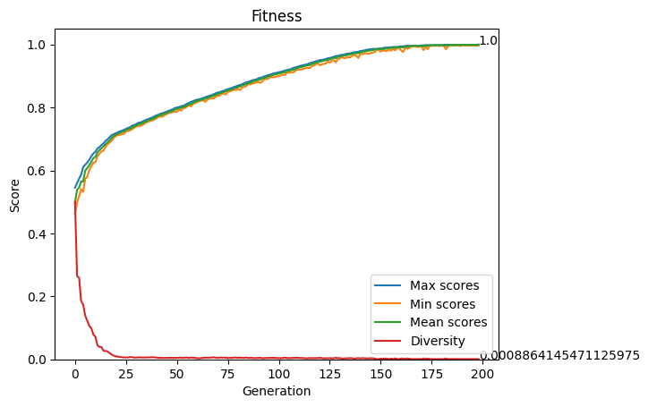
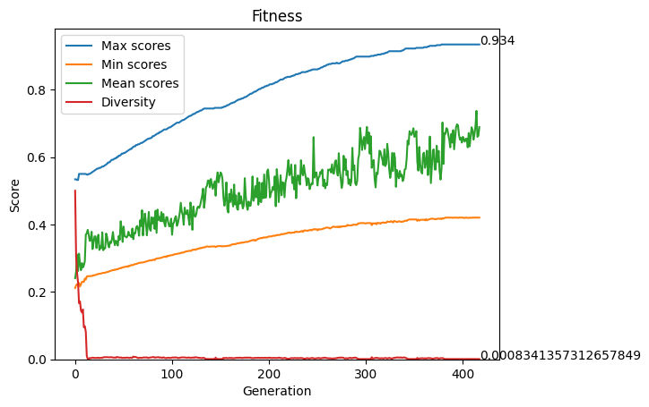
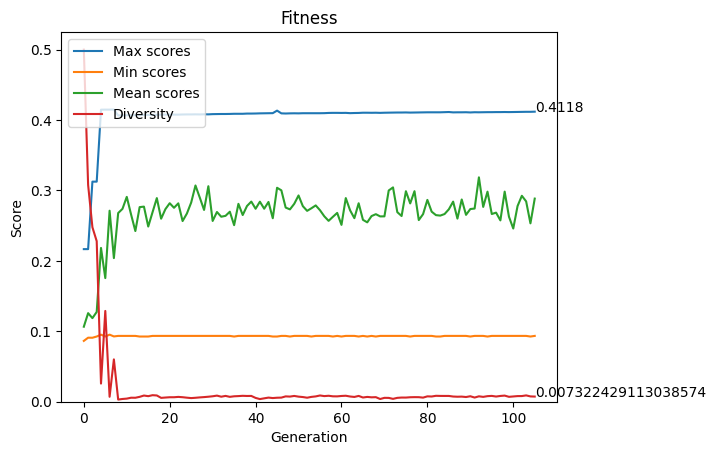
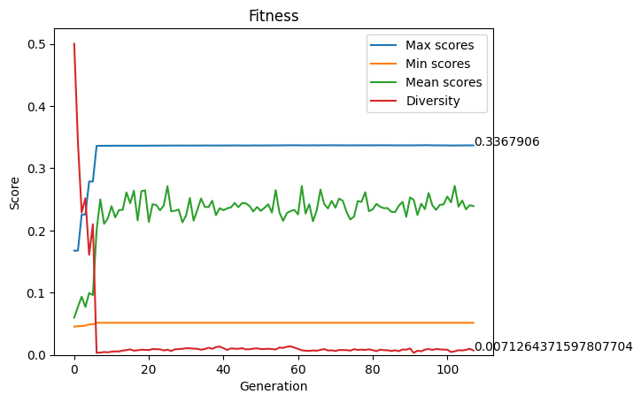

# Genetic algorithm for local search

The objective here is to find the local optima using the minimum number of fitness calls. 

## Genome
The genome is a bitstring of 1000-loci.

## Fitness
The fitness function is provided as a black box in function of a problem instance (1, 2, 5 or 10 in this case).

## Diversity
The diversity between two individuals is computed as hamming distance normalized in the range [0, 1].

## Mutation
The mutation is performed with a mutation probability on each individual of the population selecting randomly one element of the genome and then switching it.

## Crossover
The crossover between two genomes is performed creating a new genome iterating each element of the two parents and chosing randomly one of the elements of the parents.

## Parent selection
A tournament selection is adopted taking from a sample of the population the individuals with the best score in function of the fitness and diversity.

`score = k * fitness + (1-k) * diversity`

## Termination
The termination of the search is reached with a convergence criteria (fitness change < 0.01 in 100 generations).

## Results
Simulation data:

- N_PARENTS = POPULATION_SIZE//3
- MUTATION_RATE = 0.5
- TOURNAMENT_SIZE = POPULATION_SIZE//3
- K = 0.7

Result table:

| Problem instance | Generations | Fitness calls | Fitness reached |
| -------- | -------- | -------- | -------- |
| 1 | 199 | 35820 | 1.0 |
| 2 | 418 | 68340 | 0.934 |
| 5 | 107 | 19220 | 0.431 |
| 10 | 108 | 17600 | 0.337 |

Here are shown the plots of population growing for each case.

### Problem istance 1:

### Problem istance 2:

### Problem istance 5:

### Problem istance 10:

# Peer review

## Done
- [Michelangelo Caretto](https://github.com/rasenqt/computational_intelligence23_24/issues/3)
- [Florentin Udrea](https://github.com/florentin1304/computational-intelligence/issues/6)

## Received
- [Martina Martini](https://github.com/SimoneBorella/computational-intelligence/issues/4)
