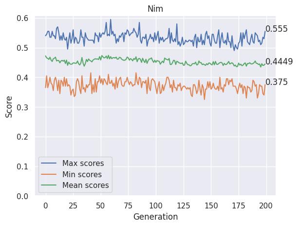
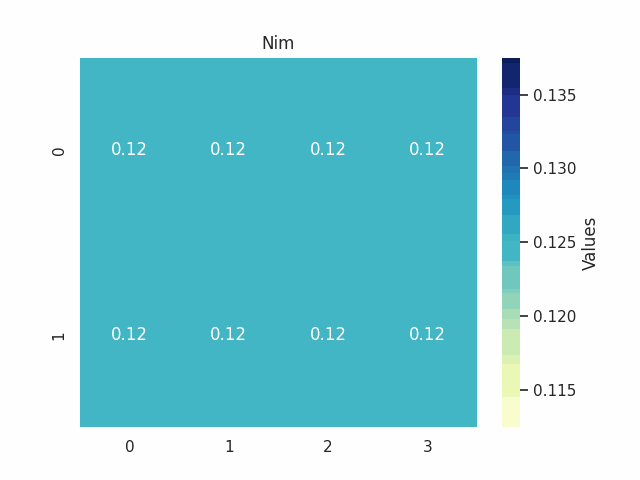

# Genetic algorithm to find Nim game strategy

## Genome
The genome structure in this algorithm is a simple set of rules which the agent will apply with a certain probability.
So the genome is represented as an array of weights between 0 and 1.

The rules applied are:
- Heap selection:
  1. Random choice
  2. Fattest heap

- Object selection:
  1. Random selection
  2. Odd selection
  3. Prime number selection
  4. Leave one strategy
   
Here is a representation of weights in an array:

`[<rand_heap>, <fat_heap>, <rand_obj>, <odd_obj>, <prime_obj>, <leave_obj>]`

## Fitness
The fitness function is evaluated as the mean of the number of wins making the agent play, for a certain number of matches, against a random agent among pure_random strategy and optimal strategy.
The two strategies are selected with a probability given by the difficulty set.
Proceeding in generations the difficulty beacomes higher and the probability to select the optimal strategy increase, allowing individuals of the population to improve against the best strategy.

## Mutation
The mutation is performed with a mutation probability on each individual of the population selecting randomly one element of the genome and then adding a gaussian random value.

## Crossover
The crossover between two genomes is performed creating a new genome iterating each element of the two parents and chosing randomly one of the elements of the parents.

## Parent selection
Three parent selection strategies are tested.
- Tournament selection is adopted taking from a sample of the population the fittest individuals
- Roulette wheel selection is adopted taking parents in a pseudo random way
- 'Best selection' taking the n best parents from the population.

## Results
Here are some data on a simulation based on these data:

- N_GEN = 200
- POPULATION_SIZE = 50
- N_PARENTS = POPULATION_SIZE//3
- MUTATION_RATE = 0.15
- FITNESS_MATCHES = 200
- TOURNAMENT_SIZE = 25

Here is a plot describing the evolution of the population.
Note that the difficulty is increasing and at the end the upper bound is supposed to be 0.5 winning rate, which is an optimal strategy agent against an other optimal strategy agent.

The best genome found at the end is the array of weights below, describing as rules the fattest heap selection and the leave one strategy for the objects selection.

`[0. 1. 0. 0. 0. 1.]`

Here is a gif describing the best individuals during the evolution of the population.

